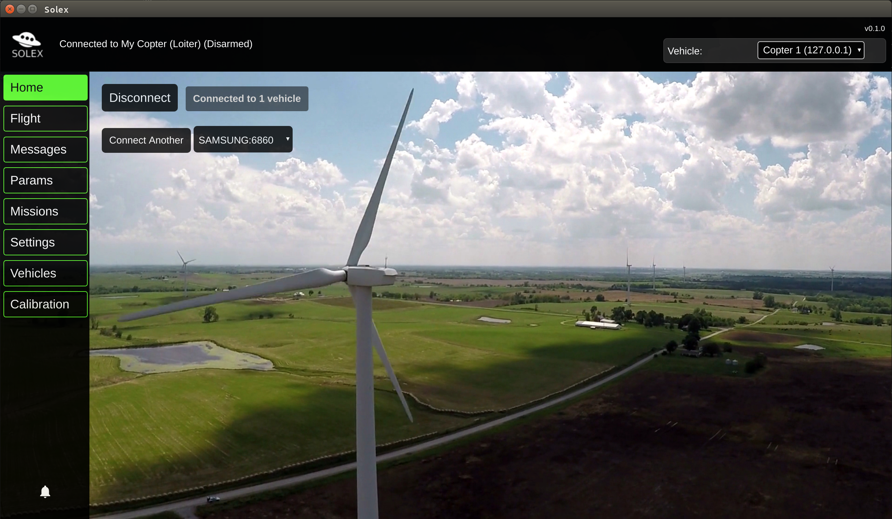
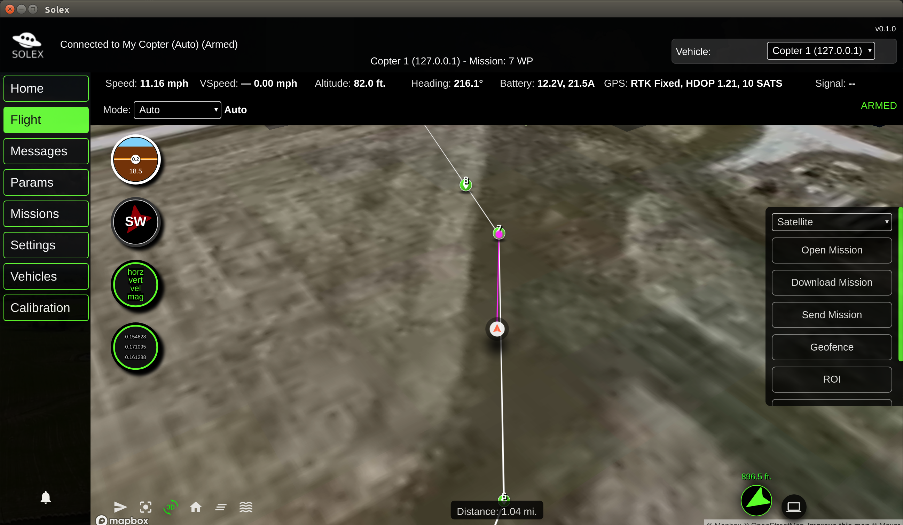

# Solex Desktop Overview

## What it is

Solex Desktop is the desktop implementation of the Solex Android app, intended for people who want to use Solex on Windows, Mac, or Linux machines.





## Not a Clone

While it has many similar features to the Android app and looks similar, it's not a clone of it. It's written in a completely different language and doesn't use DroneKit. The presence of a larger screen, higher CPU power, and a keyboard on the host machine makes it reasonable to expect different things from it, and opens up some possibilities for ways of using it that aren't practical in an Android app. This document lays out some of those features, and the basics of how they work.

### Missions

Solex comes with Missions out of the box. The structure of a mission in this app is similar to a mission in the Android app, but streamlined. For example, suppose you make a mission where you want the vehicle to run at a specific speed at a specific point in the mission. In the Android app, you would set the speed for a given waypoint. Internally, it inserts a "Change Speed" command in the generated mission. If you later decide that you want the speed change to be elsewhere in the mission, then you have to edit that waypoint to remove the speed setting and add a speed setting to a _different_ waypoint to get the desired effect. Not exactly difficult, but it's the way things work there.

In the desktop app, you just drop a "Change Speed" command on the map. It exists as a separate entity in the mission. You can see it in the "items" list for the mission, but not on the map (since there is no location associated with a "change speed" command). To change where it appears in the mission, just drag and drop it at the point in the mission where you want the speed change to take place. A real computer makes drag and drop easy.

### PX4

PX4 and ArduPilot are equally supported in Solex. A mission created for either flight controller works equally well on the other.

### Video

Solex on Android started out as an app for the 3DR Solo, which had one video source. It was later expanded to include support for RTSP and other video sources. 
As a result, the Android app has to figure out at runtime what kind of video source it's dealing with, which is complicated. 

Solex on the desktop is intended to be more flexible in this area. If you have a UDP video source (as you likely would on something that works like a Solo), you tell Solex what the IP and port of the UDP source are in the Settings screen. When you open the Flight screen, Solex tries to get data from that source and if it can get it, displays a selector at the bottom of the screen letting you switch between map and video views. TCP video also works, with different "visual effects" present when the network connection is sub-optimal. An RTSP video source will be added soon.

Latency on the UDP source is verified to be in the 50ms range using a command line like this for streaming:
```
ffmpeg -f v4l2 -framerate 30 -video_size 1280x720 -i /dev/video0 -f mpegts -codec:v mpeg1video -s 640x360 -b:v 1000k -bf 0
```

### Vehicle console

Solex has a "vehicle console" that presents a command line for controlling the vehicle. It's similar to the "mavproxy" tool familiar to ArduPilot developers, but not _actually_ mavproxy, and not the _same_ as mavproxy. So if you find yourself wondering "Why doesn't this do _X_ like mavproxy does?" It's because it's
_not `mavproxy`_.

You can arm, disarm, launch, land, start missions, stop missions, skip around in missions, point the vehicle at ROIs, etc. You can also extend the console to 
include whatever commands you want.

Here's a set of commands you might use to launch a mission:

```
mode guided              	# Switch to guided mode
arm                      	# Arm the vehicle
takeoff 10               	# Take off to 10 meters altitude
mission start            	# Start the mission
```

Once underway, you can do things like this:
```
mission jump 10				# Skip to the 10th item in the mission
mission restart				# Rewind to the beginning
go home	 					# Quit and come home
```

You can also do things with ROIs:
```
roi east 1000				# Set a ROI 1000m east of the vehicle's position. A marker appears on the map that you can drag around
roi front 20 4				# Focus on a point 20m in front of the vehicle at 4m altitude
roi clear					# Clear the ROI
```

You can also "drive around":
```
go south 100				# Just what it says
go ne 20					# "ne" is northeast
go back 15					# back up 15m
go forward 10				# go forward 10m
go left 20					# 270 degrees from where the vehicle is pointed
turn left 90				# turn left 90 degrees
turn by -80					# turn left 80 degrees
```

There are also commands for retrieving and setting parameters:
```
param show COMPASS          # Show all params/values starting with "COMPASS"
param set COMPASS_LEARN 1	# turn on compass learning
param show COMPASS_LEARN	# verify it's turned on
param show wp 				# View all params with "WP" in their name
param refresh				# Reload/refresh params from the vehicle
param save (filename)		# Save the current parameters in a file in the `params` directory with the specified name.
param load (filename)		# Load the params in `filename` and display them.
param load (filename)		# Apply the params in `filename` to the vehicle. Note that this doesn't have to be ALL of the params. You can put any number of params in a file.
param diff (filename)		# Compare the contents of `filename` with params on the vehicle and show the differences.
```

Setting modes:
```
mode auto					# Switch to AUTO
mode rtl 					# Switch to RTL
mode asdf                   # Mode name doesn't exist; Will show a list of available modes
```

Showing vehicle state:
```
state attitude				# Show internal vehicle attitude
state altitude				# Show internal vehicle altitude
state version				# Show vehicle version
state help					# Show all available state commands
```

At any time, you can type `help` to get a list of commands or `help (command)` to get help for a particular command.

The available modes vary by whether the vehicle is Ardupilot or PX4, so `mode auto` on PX4 won't work. If you're at a loss as to what modes are available, just 
type a `mode` command anyway. Something like `mode i have no idea` will give you a list of available modes, rather than an error message. 

You can type `help` to get a list of all commands and how to use them, and `help (command)` to get help on a specific command.

The console also interacts with the map view where it makes sense. So something like `roi east 100` will cause a ROI marker to appear on the map. You can drag that
marker around to change the ROI location, or right-click it to clear it.


### Extensions

You can write simple classes and scripts to extend Solex to suit what you're interested in doing. You can extend the UI of the flight screen to add 
buttons and other controls to it. You can make custom mission items. You can add custom commands to the vehicle console. You can create your own interface
to a camera or other devices you might have attached to your vehicle. See the `examples` folder to read about each of the extension types.

#### Installing the Extensions

Simple! Open the `examples` folder, and drag each of the folders in it to the `ext` folder in your `Solex` directory. Then when you start Solex, the extensions will be available.

### Links

- [Location Sources](doc/location_source.md)
- [External Channels](doc/ext-channels.md)


